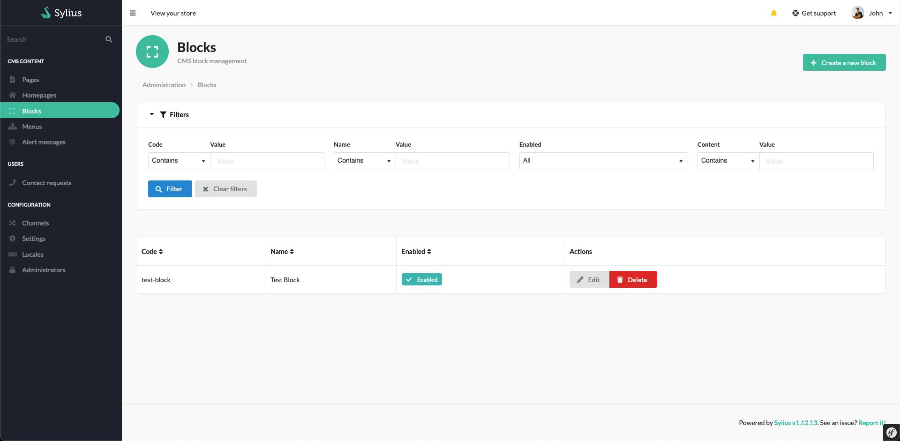
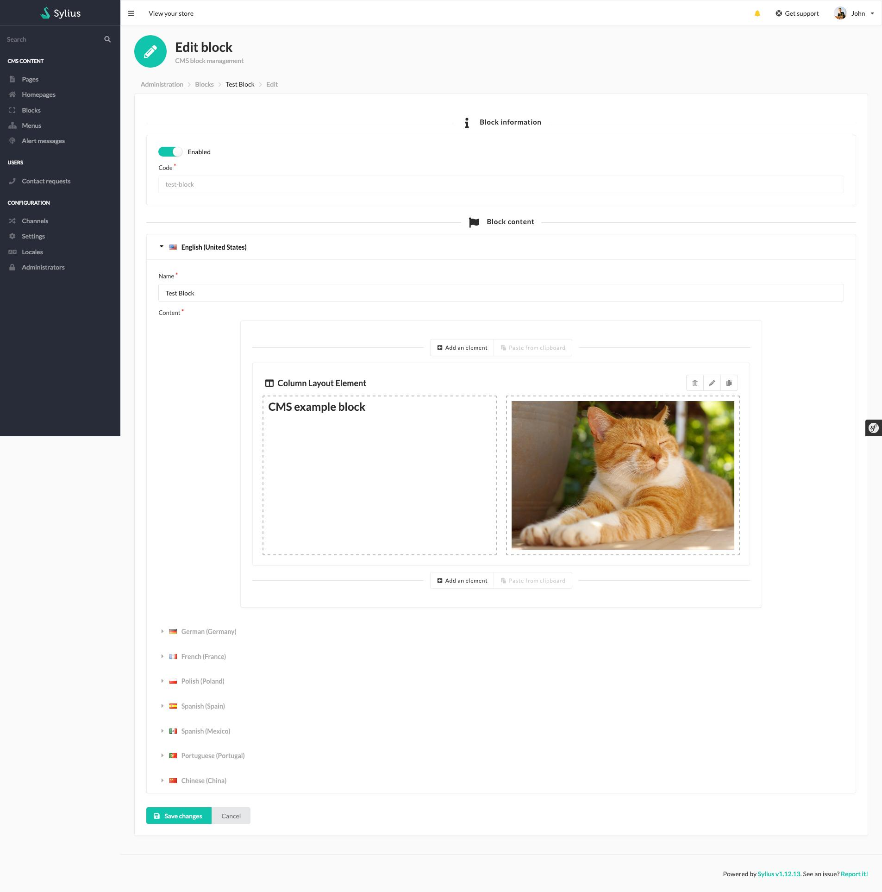
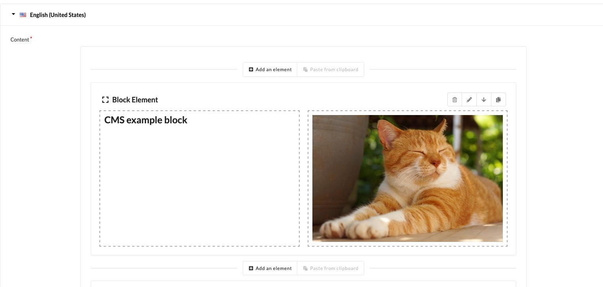
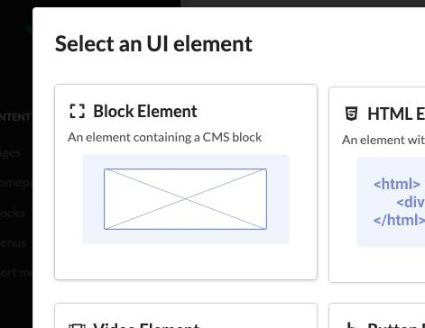
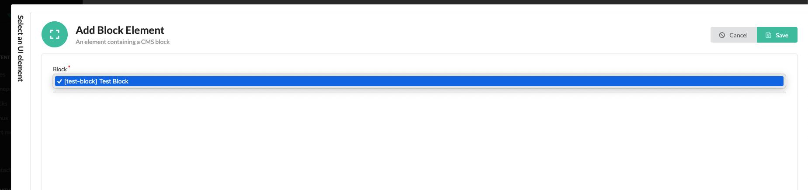
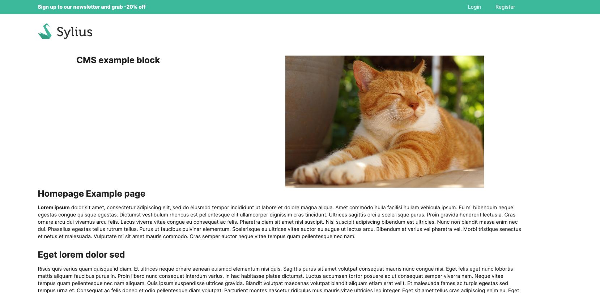

# Sylius Cms Block Plugin

## Example

### Admin list

Manage your block in admin



### Admin form

Manage the content of your block, you can decide to disable or enable it to display it anywhere you used it.



### Include it in your content

For example in your [Homepage](https://github.com/monsieurbiz/SyliusHomepagePlugin) ou [CMS Page](https://github.com/monsieurbiz/SyliusCmsPagePlugin/) !



By using `block` element in your [Rich Editor](https://github.com/monsieurbiz/SyliusRichEditorPlugin/).



Chose the block you want to include in your content.



### Displays in front

You can use it in multiple places, it will shown the same content everywhere.



If you disable the block, it will not be displayed anymore.

## Installation

Run the recipe and run migrations 

```
console doctrine:migrations:migrate -n
```

## License

This plugin is under the MIT license.
Please see the [LICENSE](LICENSE) file for more information.
